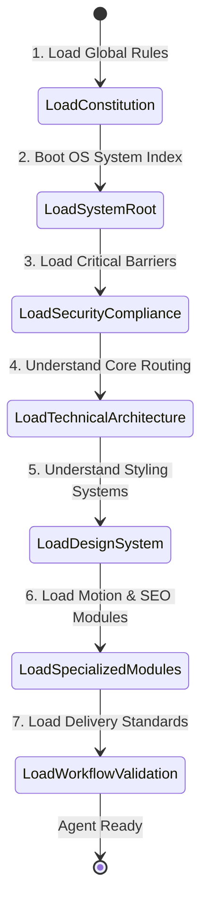
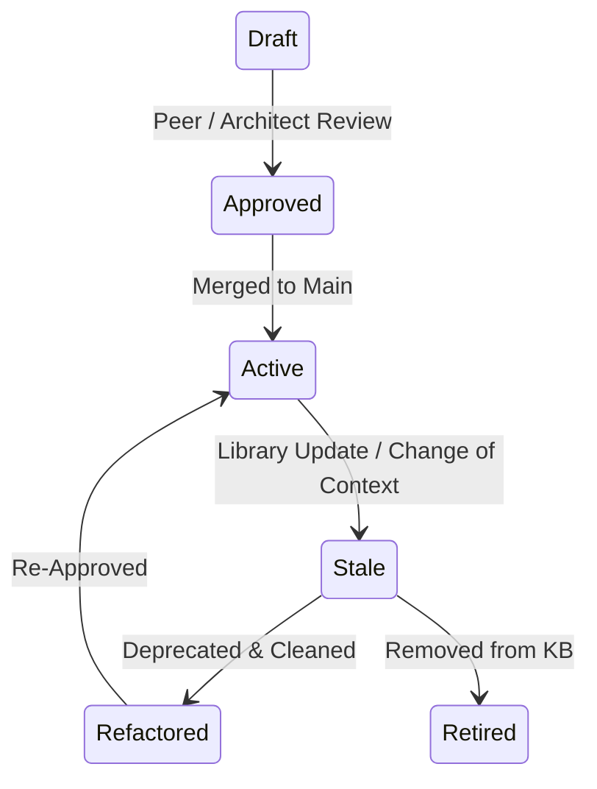

# `.ai/` Knowledge Base Architecture & Operating System

This directory houses the machine-readable knowledge base and execution guidelines for all AI agents collaborating on the Hussam Mabrouk Personal Branding Website. It functions as the operational extension of the project's [Constitution](file:///g:/hossam%20mabrouk/.specify/memory/constitution.md) (which remains the absolute highest authority).

---

## 1. Folder Hierarchy

```text
.ai/
├── README.md                           # System bootstrapper, Override rules, Conflict resolution
├── architecture/
│   └── backend-routing.md             # Next.js 15 App Router, RSC boundaries, Data fetch layer
├── design-system/
│   └── styles-primitives.md           # Tailwind CSS v4, shadcn/ui, Radix UI design tokens
├── motion/
│   └── interactive-3d.md             # Framer Motion orchestration, R3F WebGL canvas rendering
├── seo/
│   └── optimization-metadata.md       # JSON-LD Schema.org dynamic generation, Meta rules
├── compliance/
│   └── regional-security.md           # Geo-routing, GDPR compliance, token security, rate limiting
└── workflow/
    └── review-validation.md           # Definition of Done, automated testing, agent boundaries
```

---

## 2. File specifications

### File 1: `.ai/README.md`
* **Filename**: `file:///g:/hossam%20mabrouk/.ai/README.md`
* **Purpose**: Serves as the gateway, index, onboarding guide, and conflict resolution manual for all AI agents.
* **Responsibility**: Bootstrapping agent context, defining documentation lifecycle, and establishing execution order.
* **Sections**:
  * Folder Hierarchy & Manifest
  * Dependency Graph & Execution Order
  * Agent Onboarding & Reading Protocol
  * Conflict Resolution Strategy & Override Matrix
  * Documentation Lifecycle & Maintenance Policies
* **Dependencies**:
  * [Constitution](file:///g:/hossam%20mabrouk/.specify/memory/constitution.md) (direct downstream consumer)
* **Update Frequency**: Low (only when adding/removing knowledge domains or amending core system behaviors; Minor/Major version bumps).
* **AI Agents That Must Read It**: All agents (Planner, Task Executor, Reviewer, Optimizer).
* **Priority**: CRITICAL (Must be read first on every system initialization).

---

### File 2: `.ai/architecture/backend-routing.md`
* **Filename**: `file:///g:/hossam%20mabrouk/.ai/architecture/backend-routing.md`
* **Purpose**: Govern Next.js 15 routing, Server Component data fetching, and state isolation boundaries.
* **Responsibility**: Ensuring correct use of React Server Components (RSC) and secure server action APIs.
* **Sections**:
  * Next.js 15 App Router Directory Conventions (Layout, Page, Loading, Error)
  * Server vs. Client Component Boundaries & Hydration Rules
  * Data Fetching Patterns (Fetch Cache, Incremental Static Regeneration, Revalidation)
  * Server Actions & Security Sanitization Interfaces
  * Third-Party Adapter Patterns (MongoDB client decoupling, mailer integration)
* **Dependencies**:
  * [Constitution](file:///g:/hossam%20mabrouk/.specify/memory/constitution.md) (specifically Server/Client Component Rules)
* **Update Frequency**: Medium (when Next.js routing patterns or core database driver abstractions are updated).
* **AI Agents That Must Read It**: Planner Agent, Task Executor Agent.
* **Priority**: HIGH.

---

### File 3: `.ai/design-system/styles-primitives.md`
* **Filename**: `file:///g:/hossam%20mabrouk/.ai/design-system/styles-primitives.md`
* **Purpose**: Align styling implementation with Tailwind CSS v4 and head-free component frameworks.
* **Requirements**:
  * Enforces usage of Radix UI primitives and shadcn/ui custom states.
  * Regulates typography scales, custom animations classes, and dark-mode-centric colors.
* **Sections**:
  * Tailwind CSS v4 Theme Variables & Configuration Map
  * Accessible Primtives Setup (Radix UI / shadcn/ui tokens)
  * Responsive Layout Grid Systems & Typography Rules
  * Form Elements Styling & Validation State Layouts (React Hook Form Integration)
* **Dependencies**:
  * [Constitution](file:///g:/hossam%20mabrouk/.specify/memory/constitution.md) (specifically Design System Governance)
* **Update Frequency**: Low (only during major design system shifts or Tailwind compiler upgrades).
* **AI Agents That Must Read It**: Frontend Implementer Agent, UI/UX Reviewer Agent.
* **Priority**: HIGH.

---

### File 4: `.ai/motion/interactive-3d.md`
* **Filename**: `file:///g:/hossam%20mabrouk/.ai/motion/interactive-3d.md`
* **Purpose**: Standardize premium animation logic, performance constraints, and WebGL elements.
* **Responsibility**: Keeping rendering performance above 60 FPS while enabling premium 3D/2D animation effects.
* **Sections**:
  * Framer Motion Layout Transitions & Orchestration (spring curves, layoutId)
  * React Three Fiber (R3F) WebGL Canvas Optimization Protocols
  * Canvas Resizing, Fallbacks, and Device Capability Checks
  * Animation Performance Budgets (FPS tracking, thread offloading)
  * Accessibility Easing (Reduced Motion settings mapping)
* **Dependencies**:
  * [Constitution](file:///g:/hossam%20mabrouk/.specify/memory/constitution.md) (specifically Motion & Animation Governance)
* **Update Frequency**: Medium (when modifying interactive branding canvas designs or rendering engines).
* **AI Agents That Must Read It**: Motion Specialist Agent, Performance Auditor Agent.
* **Priority**: MEDIUM.

---

### File 5: `.ai/seo/optimization-metadata.md`
* **Filename**: `file:///g:/hossam%20mabrouk/.ai/seo/optimization-metadata.md`
* **Purpose**: Codify search indexing, OG metadata validation, and Schema.org rich results layout.
* **Responsibility**: Maximizing global brand discoverability and search layout optimization.
* **Sections**:
  * Next.js metadata API implementation rules (statically & dynamically generated)
  * JSON-LD Script Embeds & Schema.org validators (Person, Organization, Service markup)
  * Heading Tree Sementics & Semantic HTML5 structures
  * OpenGraph (OG) & Twitter card metadata criteria
* **Dependencies**:
  * [Constitution](file:///g:/hossam%20mabrouk/.specify/memory/constitution.md) (specifically SEO & Schema.org Governance)
* **Update Frequency**: Low (only when changing structured data layouts or global SEO targets).
* **AI Agents That Must Read It**: SEO Optimizer Agent, Writer Agent.
* **Priority**: HIGH.

---

### File 6: `.ai/compliance/regional-security.md`
* **Filename**: `file:///g:/hossam%20mabrouk/.ai/compliance/regional-security.md`
* **Purpose**: Enforce global user protection, token-based authentication logic, and compliance rules.
* **Responsibility**: Protecting administrative endpoints and maintaining international standards compliance.
* **Sections**:
  * JWT Auth tokens & Secure HttpOnly cookie architectures
  * Middleware redirection & Protected admin route layers
  * GDPR Compliance, cookie consent management, and data encryption
  * API Rate Limiting, input parsing, and DDoS mitigation practices
* **Dependencies**:
  * [Constitution](file:///g:/hossam%20mabrouk/.specify/memory/constitution.md) (specifically Security & GEO Governance)
* **Update Frequency**: High (when security protocols, API keys validation mechanisms, or global compliance laws evolve).
* **AI Agents That Must Read It**: Security Auditor Agent, Backend Developer Agent.
* **Priority**: CRITICAL.

---

### File 7: `.ai/workflow/review-validation.md`
* **Filename**: `file:///g:/hossam%20mabrouk/.ai/workflow/review-validation.md`
* **Purpose**: Outline tests validation, review workflows, code delivery checkpoints, and agent scope boundaries.
* **Responsibility**: Enforcing quality gates and the "Definition of Done".
* **Sections**:
  * Unit Testing boundaries & Mock structures
  * Automated testing verification pipelines (CI/CD settings integration)
  * Code Review checklist & Pull Request validation guidelines
  * Definition of Done (DoD) checklist
  * Technical debt registration & refactoring cycles rules
* **Dependencies**:
  * [Constitution](file:///g:/hossam%20mabrouk/.specify/memory/constitution.md) (specifically Definition of Done, Review, & Refactoring rules)
* **Update Frequency**: Medium (when CI/CD integration pipelines or test coverage mandates change).
* **AI Agents That Must Read It**: Reviewer Agent, Automated Tester Agent.
* **Priority**: HIGH.

---

## 3. Dependency Graph

```mermaid
graph TD
    classDef critical fill:#f96,stroke:#333,stroke-width:2px;
    classDef high fill:#ff9,stroke:#333,stroke-width:2px;
    classDef medium fill:#bbf,stroke:#333,stroke-width:2px;

    Const[".specify/memory/constitution.md"] ::: critical
    SystemRoot[".ai/README.md"] ::: critical
    Architecture[".ai/architecture/backend-routing.md"] ::: high
    DesignSystem[".ai/design-system/styles-primitives.md"] ::: high
    Motion[".ai/motion/interactive-3d.md"] ::: medium
    SEO[".ai/seo/optimization-metadata.md"] ::: high
    Compliance[".ai/compliance/regional-security.md"] ::: critical
    Workflow[".ai/workflow/review-validation.md"] ::: high

    Const --> SystemRoot
    SystemRoot --> Architecture
    SystemRoot --> DesignSystem
    SystemRoot --> Compliance
    SystemRoot --> Workflow
    
    Architecture --> Motion
    Architecture --> SEO
    DesignSystem --> Motion
    Compliance --> Architecture
    Workflow --> SystemRoot
```

---

## 4. Reading & Onboarding Order

When a new AI Agent is initialized in the workspace, it MUST execute the reading sequence below:



1. **Phase 1: Global Rules Definition** — Read [Constitution](file:///g:/hossam%20mabrouk/.specify/memory/constitution.md) to understand project philosophy and core engineering boundaries.
2. **Phase 2: OS System Indexing** — Read `.ai/README.md` to map dependencies and verify overriding protocols.
3. **Phase 3: Critical Security Barriers** — Read `.ai/compliance/regional-security.md` to identify restricted operations (API keys, CORS, sanitization).
4. **Phase 4: Core Technical Architecture** — Read `.ai/architecture/backend-routing.md` to map routing directories, RSC, and data patterns.
5. **Phase 5: UI/UX Standards** — Read `.ai/design-system/styles-primitives.md` to map layout grids and utility patterns.
6. **Phase 6: Specialized Modules** — Read `.ai/motion/interactive-3d.md` and `.ai/seo/optimization-metadata.md` depending on the current task scope.
7. **Phase 7: Delivery Standards** — Read `.ai/workflow/review-validation.md` before committing any code changes or generating tasks.

---

## 5. Document Override Rules & Hierarchy

When directives or design choices overlap, agents MUST follow this strict override protocol:

```text
Level 1: .specify/memory/constitution.md (Immutable Global Authority)
   │
   └── Level 2: .ai/README.md (AI Operating System Index)
         │
         ├── Level 3: .ai/compliance/regional-security.md (Core Security Restrictions)
         │
         ├── Level 4: .ai/architecture/backend-routing.md (Next.js Architectural Boundaries)
         │
         └── Level 5: Sub-domain Guideline Files (UI/UX, Motion, SEO, Workflow Specs)
```

1. **Level 1 (Constitution)**: Absolute rule. No guideline inside `.ai` may ease a restriction declared in the Constitution.
2. **Level 2 (`.ai/README.md`)**: Governs overall file associations.
3. **Level 3 (`.ai/compliance/regional-security.md`)**: Takes precedence over all routing and rendering instructions. If a Next.js optimization patterns file requests caching, but security rules require session validation headers, security rules override.
4. **Level 4 (`.ai/architecture/backend-routing.md`)**: Governs structure. If a UI stylesheet or animation block interferes with Next.js layout patterns, the routing file rules override.
5. **Level 5 (Domain Guidelines)**: Govern local modules.

---

## 6. Conflict Resolution Strategy

If an agent encounters contradictions between different documentation layers, the agent MUST resolve them using the following protocol:

1. **Check the Override Hierarchy**: Apply the higher-level document rule immediately.
2. **Check Specificity**: If the conflict occurs at the same hierarchy level, the more specific rule MUST override the more generic one.
3. **Log & Notify**:
   * Stop task execution.
   * Write a contradiction report to the current implementation plan or task file.
   * Propose a fix (e.g., adding an exception clause) and wait for a human developer or architect review.
4. **No Speculative Bypassing**: The agent MUST NOT write code that bypasses a rule when a conflict is active.

---

## 7. Documentation Lifecycle

To prevent outdated guidelines and keep documentation maintenance to a minimum, the project operates on a strict lifecycle policy:



* **Creation (Draft)**: New guides MUST be written inside the appropriate `.ai` folder. They require review by the system architect.
* **Maintenance (Active)**: Any agent modifying a component that changes a core pattern MUST update the corresponding `.ai/` document synchronously as part of the PR.
* **Deprecation (Stale)**: When a technology stack is upgraded (e.g., Next.js v15 to v16), corresponding files are marked as `[DEPRECATED]` at the top. They must be cleaned within the next sprint cycle.
* **Retirement**: Obsolete rules MUST be deleted completely from the directory tree to prevent search index pollution for future agents.
