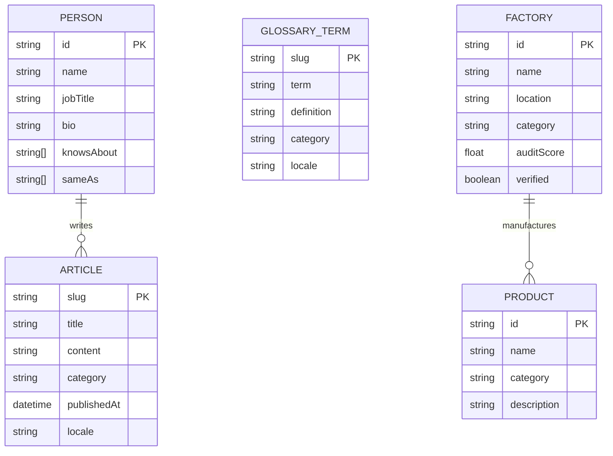
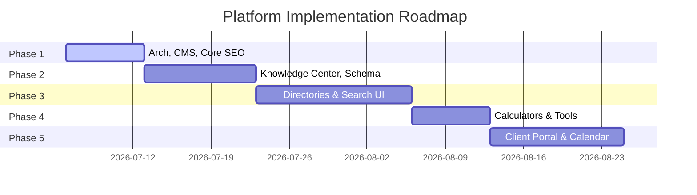

# Project Blueprint: Hussam Mabrouk Personal Branding Platform

This blueprint provides a comprehensive reverse-engineered architectural overview of the Hussam Mabrouk personal brand platform. It details the current structural state, technological decisions, implementation patterns, and future scaling roadmap, enabling any senior engineer or AI agent to understand and collaborate on the system.

---

## 1. Executive Summary

### What is this Project?
This project is the digital foundation of **hossammabrouk.com**, the personal brand and knowledge platform of Hussam Mabrouk, an international trade, sourcing, and import/export expert. Rather than acting as a simple portfolio, the site is designed to evolve into a multi-language content engine, business directory (sourcing factories, suppliers, products), and a transactional client portal.

### Business Goals
* **Establish Authority**: Establish Hussam Mabrouk as a primary Arabic/English authority on global trade, logistics, and China sourcing.
* **Lead Generation**: Capture consulting, auditing, and sourcing leads from importers, factory owners, and e-commerce sellers.
* **Knowledge Indexing**: Evolve into the largest online repository of Arabic international trade guides, glossary terms, and compliance resources.

### Technical Goals
* **Zero-latency Performance**: Maintain rapid loading speeds to secure high Core Web Vitals scores.
* **AI-Engine Optimization (GEO)**: Optimize content relationships, hierarchy, and schema markup so AI retrieval engines (Gemini, Perplexity, ChatGPT) accurately index and reference Hussam Mabrouk's expertise.
* **Clean Maintainability**: Structure components using Next.js App Router rules and a strict Feature-First structure.

### Maturity Level & Completion Percentage
* **Current Maturity**: **Stage 1 (Interactive Landing Page Portfolio)**
* **Target Maturity**: **Stage 5 (Authoritative Multi-Language Knowledge Engine & Secured Client Portal)**
* **Overall Completion Percentage**: **15%** (Only the core layout skeleton and i18n configurations exist; directories, CMS integration, tools, and dynamic databases are missing).

---

## 2. Technology Stack

| Technology | Purpose | Strategic Decision Rationale |
| :--- | :--- | :--- |
| **Next.js 15.1.0 (App Router)** | Framework | Provides filesystem routing, Server-Side Rendering (SSR) for SEO, and Server Components to minimize Client-Side JS. |
| **React 19** | UI Library | Supports React Server Components (RSC) and React 19 rendering optimization. |
| **TypeScript** | Language | Enforces compile-time type-safety contracts across API endpoints, data models, and component props. |
| **Tailwind CSS v4** | CSS Compiler | Performance-oriented CSS engine utilizing native CSS variables, container queries, and `@theme` parameters. |
| **Framer Motion 11.15.0** | Animation | High-performance visual transitions, spatial layout shifts (`layoutId`), and scroll-bound animations. |
| **Three.js / React Three Fiber** | 3D Graphics | Scaffolded in `package.json` to support dynamic 3D logistics globes and visual overlays. |
| **Lucide React** | Icons | Provides clean, scalable SVG iconography. |
| **Zod / React Hook Form** | Form Validation | Validates input structures on both Client and Server boundaries. |

---

## 3. Current Folder Structure

```text
hossam-mabrouk/
├── .agents/                    # Spec Kit workflows and agent configuration assets
├── .specify/                   # Spec Kit configuration, workflows, scripts, and templates
├── public/                     # Static public assets (images, vectors, fonts)
├── specs/                      # Feature specifications, plans, and task trackers
│   ├── 001-project-scaffolding-setup/
│   ├── 002-i18n-landing-page/
│   ├── 003-design-system-typography/
│   ├── 004-hero-section-enhancements/
│   └── 005-platform-gap-analysis/
├── src/                        # Source Code Directory
│   ├── app/                    # Next.js App Router (Layouts, Pages, Middleware)
│   │   ├── [locale]/           # Dynamic localization route segment
│   │   │   ├── layout.tsx      # Main layout (typography config, cursor elements, headers)
│   │   │   └── page.tsx        # Monolithic home page template containing section layouts
│   │   ├── api/                # Future API routes
│   │   ├── globals.css         # CSS resets, Tailwind imports, theme variables
│   │   └── layout.tsx          # Root layout wrapper
│   ├── components/             # Shared stateless UI elements
│   │   ├── CursorGlow.tsx      # Custom mouse tracking halo
│   │   ├── FloatingSocials.tsx # Profile picture container with orbit social badges
│   │   ├── Header.tsx          # Navigation bar with mobile overlay
│   │   ├── LanguageSwitcher.tsx# Dynamic locales language switcher
│   │   └── TypingHeadline.tsx  # Hero typed title headlines
│   ├── dictionaries/           # JSON translations files
│   │   ├── ar.json             # Arabic locale dictionary
│   │   └── en.json             # English locale dictionary
│   ├── features/               # Feature-First Architecture Modules
│   │   └── i18n/               # Localization features (getDictionary helpers)
│   │       ├── get-dictionary.ts
│   │       └── index.ts
│   └── lib/                    # Standard utilities, class helper hooks
│       └── utils.ts            # Dynamic class merge parameters (clsx + tailwind-merge)
├── eslint.config.mjs           # ESLint rules configuration
├── next.config.ts              # Next.js compiler settings
├── package.json                # Project dependencies and script configs
└── tsconfig.json               # TypeScript compiler config rules
```

---

## 4. Current Architecture

```mermaid
graph TD
    subgraph Client [Client Browser]
        CG[CursorGlow]
        FS[FloatingSocials]
        TH[TypingHeadline]
        LS[LanguageSwitcher]
    end

    subgraph AppRouter [Next.js App Router]
        MW[middleware.ts] -->|Locale Prefix| LLayout[[locale] layout.tsx]
        LLayout --> LPage[[locale] page.tsx]
    end

    subgraph FeatureFirst [Feature Modules]
        F_i18n[features/i18n]
    end

    subgraph SharedLayer [Shared Utilities & Components]
        Header[components/Header]
        Dict[dictionaries/ ar.json / en.json]
        Utils[lib/utils.ts]
    end

    LPage -->|Reads Translations| F_i18n
    F_i18n -->|Parses| Dict
    LLayout -->|Renders| Header
    Header -->|Invokes| LS
    LPage -->|Renders| CG
    LPage -->|Renders| FS
    LPage -->|Renders| TH
```

* **Feature-First Architecture**: Features are organized in isolated domains inside `src/features/` (e.g. `src/features/i18n/`). Modules communicate externally only via public API gateways (`index.ts` files).
* **Shared Layer**: Shared stateless components (e.g., CursorGlow, Header) live in `src/components/`, while general class utilities (e.g. `cn` helper) live in `src/lib/`.
* **Routing**: Next.js App Router utilizes localization directory routing (`src/app/[locale]/`). A middleware file (`middleware.ts`) checks cookies and routes default traffic to Arabic (`/ar`) or English (`/en`).
* **Components & Providers**: Layout wrappers in `src/app/[locale]/layout.tsx` resolve text-direction parameters (`rtl` / `ltr`) based on the active locale, applying localized Google Fonts (Beiruti for Arabic, Bricolage Grotesque & Inter for English) through CSS variables.

---

## 5. Design System

The platform's styling system is implemented in `src/app/globals.css` using Tailwind CSS v4 design tokens.

### Typography
* **Arabic Headings & Body**: Beiruti (`--font-arabic`) — a custom fluid-scaling font weight layout (300 to 700).
* **English Headings**: Bricolage Grotesque (`--font-display`) — a modern display font.
* **English Body**: Inter (`--font-body`) — a highly readable sans-serif.
* **Code/Numbers**: JetBrains Mono (`--font-mono`).
* **Fluid Font Sizes**: Configured via `clamp()` (e.g., Display: `clamp(2rem, 5.5vw, 5rem)`, Title 1: `clamp(1.75rem, 4.5vw, 3.25rem)`).

### Spacing Scale (8px System)
Mapped to `sp-1` through `sp-12`:
* `sp-1`: 4px | `sp-2`: 8px | `sp-3`: 12px | `sp-4`: 16px | `sp-5`: 24px | `sp-6`: 32px | `sp-7`: 48px | `sp-8`: 64px | `sp-9`: 96px | `sp-10`: 128px | `sp-11`: 160px | `sp-12`: 200px.

### Colors
* **Primary Neutrals**: Deep Slate / Black (`#08090B`), Graphite Neutrals (`#111318`, `#181B20`, `#20242C`, `#2B303A`), White/Cream (`#F7F6F2`, `#EAE8E1`).
* **Secondary Accents**: Premium Gold (`#C7A15C`), Soft Gold (`#E8D2A0`), Deep Blue (`#16223F`), Slate Blue (`#223257`).
* **Highlights**: Cyan (`#7FE3DC`), Muted Orange (`#E7A67E`), Ink Text (`#14161B`, `#565A63`).

### Radii & Shadows
* **Radii**: `xs` (6px), `sm` (12px), `md` (20px), `lg` (28px), `xl` (40px).
* **Shadows**: Standard light-to-heavy shadows (`sm`, `md`, `lg`) and a custom `shadow-gold` glow (`0 8px 40px rgba(199,161,92,0.18)`).

### Glassmorphism Tokens
* `background-glass`: `rgba(255, 255, 255, 0.045)`
* `background-glass-strong`: `rgba(255, 255, 255, 0.07)`
* `border-glass`: `rgba(255, 255, 255, 0.09)`

### Motion & Animations
* **Beam Rotate**: `beamRotate 40s linear infinite` (conic light beams).
* **Float Y**: `floatY 7s ease-in-out infinite` (floating interactive social badges).
* **Marquee**: `marquee 22s linear infinite` (bento grid layouts).
* **Reduced Motion Support**: Media queries automatically reset transition times and animations if `prefers-reduced-motion` is active.

---

## 6. Current Pages

| Route | Purpose | Status | Components Used | SEO Status | GEO Status | Responsive Status |
| :--- | :--- | :--- | :--- | :--- | :--- | :--- |
| `/[locale]` | Hub Landing Page (Hero, Sourcing Details, Global Experience map, Bento Sectors, Services Track, Timeline, Testimonials, Bookings). | 🟡 Partially Implemented (Layout static skeleton) | `Header`, `CursorGlow`, `FloatingSocials`, `TypingHeadline`, `LanguageSwitcher` | ⚠ Needs Improvement (Missing canonical links, hreflang alternates) | ❌ Missing (No JSON-LD Person/Org schemas) | ✅ Fully Implemented (Grid structures adjust to mobile/tablet breakpoints) |

---

## 7. Current Features

### 1. Internationalization Framework
* **Purpose**: Dynamic translation system rendering Arabic (RTL) or English (LTR) layouts based on route parameters.
* **Components**: `LanguageSwitcher` (UI), `src/features/i18n/get-dictionary.ts` (JSON loader).
* **State**: Fully functional.
* **Dependencies**: Next.js middleware, filesystem locale segments.

### 2. Interactive Social Globe Hero Visual
* **Purpose**: Floating radial personal photo frame surrounded by orbiting interactive social media buttons (LinkedIn, WhatsApp, Email, X).
* **Components**: `FloatingSocials` (React component built with Framer Motion).
* **State**: Fully functional.
* **Dependencies**: Framer Motion, Lucide React.

### 3. Typing Headline Title Animation
* **Purpose**: Smooth typewriter effect showcasing areas of expertise (Sourcing, Shipping, Customs).
* **Components**: `TypingHeadline`.
* **State**: Fully functional.
* **Dependencies**: React State hooks.

---

## 8. Missing Features

The following system capabilities are missing and categorized by operational domain:

| Domain | Missing Feature | Description | Priority | Complexity | Dependencies |
| :--- | :--- | :--- | :--- | :--- | :--- |
| **Content Engine** | **Headless CMS / MDX** | Local markdown file parser or Sanity integration to manage articles, success stories, and trade guides. | High | Medium | Phase 1 Scaffolding |
| **SEO / GEO** | **JSON-LD Schema Engine** | Parser generating Person, Organization, and BreadcrumbList schemas. | High | Medium | None |
| **Directories** | **Factories & Supplier Directory** | Searchable grid listing certified manufacturers with audit scores and location indicators. | Medium | High | Database / CMS |
| **Directories** | **Product Library** | Organized catalog showcasing sourced materials, categories, and manufacturing origins. | Medium | High | Database / CMS |
| **Utilities** | **Interactive Tools Hub** | React calculators mapping shipping costs, customs tariffs, MOQs, and timezone conversions. | Medium | Medium | None |
| **Transactional** | **Google Calendar Sync** | Automated consultation booking engine replacing the visual scheduler card. | Medium | Medium | Database, API Routes |
| **Transactional** | **Client Portal** | Authenticated area where active clients can track shipments, view documents, and request consulting. | Low | High | Auth (NextAuth), database |

---

## 9. Information Architecture (Sitemap)

```text
[Current Pages]
├── /[locale] (Home Landing page)

[Future Pages]
├── /[locale]/about (Personal Brand Biography & Press Kit)
├── /[locale]/services (Transactional service detail pages: Sourcing, SCM, Audit)
├── /[locale]/blog (Article indexing lists)
│   ├── /categories/[category] (Topic clustering pages)
│   └── /[slug] (Detailed article page layout)
├── /[locale]/glossary (Trade jargon definitions index)
│   └── /[term] (Individual definition page)
├── /[locale]/success-stories (Case studies layout)
│   └── /[slug] (Detailed case study profile)
├── /[locale]/media-center (Podcast directories, videos, news releases)

[Future Platform Modules]
├── /[locale]/china-guide (China Directory, sourcing checklists)
├── /[locale]/factories-directory (Indexed listing of factory capability details)
│   └── /factories/[id] (Detailed factory audit scores and capability metrics)
├── /[locale]/supplier-directory (Verified trading suppliers listings)
├── /[locale]/product-library (Product catalog categories list)
├── /[locale]/free-tools (Duty, shipping, and MOQ calculators)
├── /[locale]/downloads (Gated ebooks, templates, and contracts)
└── /[locale]/portal (Secure Client Portal Dashboard)
    ├── /login (Auth login)
    ├── /shipments (Active shipment lane tracking)
    └── /documents (Customs clearance document exchange)
```

---

## 10. Domain Model



### Domain Attributes & Scalability
* **Person (Brand Owner Profile)**: Serves as the central metadata node for SEO / GEO schemas.
* **Knowledge Domain (Articles & Glossary)**: Supports static page generation (SSG) with incremental static regeneration (ISR) to handle large volumes of content without database queries.
* **Trade Domain (Factories, Suppliers, Products)**: Designed for relational mapping (e.g. Factory-to-Products relationships), enabling multi-dimensional searches and category filtering.

---

## 11. SEO Audit

* **Metadata Status**: Basic static configurations exist in layout roots, but dynamic canonical URLs, metadata fields for dynamic subpages, and OpenGraph/Twitter card assets are missing.
* **Structured Data (JSON-LD)**: ❌ **Missing**. No schema structures exist to clarify author identity, page types, or business properties.
* **Hreflang Configuration**: ❌ **Missing**. Layout head lacks alternate language links mapping the Arabic and English page relationships.
* **Sitemap & Robots**: ❌ **Missing**. Programmatic `sitemap.xml` and `robots.txt` endpoints are not implemented.
* **Breadcrumbs**: ❌ **Missing**. Breadcrumb tracking is not present.
* **Internal Link Optimization**: Lacking due to the single-page structure. Once subpages are implemented, semantic cross-linking (e.g. blog posts linking to relevant glossary terms) must be established.

---

## 12. GEO Audit (AI Engine Retrieval Optimization)

* **Entity Relationship Definition**: The system does not explicitly connect "Hussam Mabrouk" to "Meridian & Co." or specific trade expertise domains in a machine-readable format.
* **Person/Organization Authority**: There are no verification schemas mapping Hussam Mabrouk to authoritative registries, LinkedIn profiles, or official corporate credentials.
* **Knowledge Graph Readiness**: Low. The absence of a schema structure prevents AI bots from assembling a knowledge graph about the owner.
* **Semantic HTML**: Section containers are correctly implemented, but accessibility labels and semantic wrappers (e.g., blocking testimonials in `<figure>` grids) must be refined.
* **Author Pages**: Lacking. Sourcing blogs and guides must link directly to a verified, schema-optimized author page to build Google E-E-A-T rating scores.

---

## 13. Performance Audit

* **Core Web Vitals**: Targets are set (LCP < 2.5s, CLS < 0.1, INP < 200ms) but require active monitoring. CLS must be tested under Arabic layouts to ensure right-to-left layout adjustments do not trigger shifts.
* **Image Optimization**: The custom personal photo in the Hero uses the Next.js `Image` wrapper, which is correct. All static assets must follow this pattern, avoiding raw `` tags.
* **Font Delivery**: Fonts are correctly loaded locally via `next/font/google` in the main layout file. This avoids layout shifts and eliminates network latency from external font servers.
* **Code Splitting & Lazy Loading**: Heavy components (like future interactive calculators or WebGL maps) must use Next.js dynamic imports (`next/dynamic`) to avoid slowing down the initial page load.

---

## 14. Architecture Quality

* **SOLID Compliance**:
  * *Single Responsibility*: Violations exist. The home page file is a monolithic layout combining multiple sections.
  * *Open/Closed*: UI components are not yet designed to receive generic dynamic data, requiring visual modifications when dynamic data layers are implemented.
* **DRY & KISS**: High compliance. Layouts and utilities are simple, readable, and free of unnecessary abstractions.
* **Feature-First Architecture**: Configured but underutilized. Except for the `i18n` feature module, pages and assets are mixed together in shared folders. Future updates must isolate new domains (e.g., Blog, Directory) inside `src/features/`.

---

## 15. Project Roadmap



### Phase 1: Core Architecture, CMS, and SEO Scaffolding
* **Features**: Monolithic page extraction, local MDX content engine scaffolding, sitemap/robots setup, canonical & hreflang tags.
* **Dependencies**: None.
* **Effort**: 35 hours.
* **Order**: Extract Home components -> Setup MDX -> Dynamic SEO headers.

### Phase 2: Knowledge Center & Brand Authority
* **Features**: `/knowledge-center`, `/blog`, `/glossary`, author profile pages, JSON-LD Person/Org schema models.
* **Dependencies**: MDX Content Engine (Phase 1).
* **Effort**: 45 hours.
* **Order**: Schema builder -> Glossary -> Blog layouts.

### Phase 3: Sourcing Directories & Product Libraries
* **Features**: `/factories-directory`, `/supplier-directory`, `/product-library`, dynamic FlexSearch UI.
* **Dependencies**: Database / Content Engine (Phase 1).
* **Effort**: 60 hours.
* **Order**: Database listings schema -> Directory pages -> Filter panel -> Search bar.

### Phase 4: Sourcing Tools & Lead Gating
* **Features**: Shipping and MOQ calculators, tariff lookup tool, lead-capture forms (newsletter signup, PDF downloads).
* **Dependencies**: Core layouts.
* **Effort**: 30 hours.
* **Order**: Sourcing calculators -> Lead forms -> Newsletter integration.

### Phase 5: Transactional Portal & Bookings
* **Features**: Cal.com / Google Calendar consultation scheduling integration, Client Dashboard, Auth setup.
* **Dependencies**: Relational database (Phase 1).
* **Effort**: 50 hours.
* **Order**: NextAuth configurations -> Booking integration -> Client Dashboard.

---

## 16. Technical Debt

* **Monolithic Homepage Page (`src/app/[locale]/page.tsx`)**:
  * *Impact*: Hard to read, maintain, or test. Slower load times when all sub-elements are parsed together.
  * *Refactor*: Extract sections into feature folders under `src/features/home/components/`.
* **Relative Nav Links in Header (`src/components/Header.tsx`)**:
  * *Impact*: Relative anchors (e.g. `#about`) will fail when clicked from dynamic subpages (e.g. `/blog/some-article`).
  * *Refactor*: Dynamically prefix nav links with the current locale and an absolute path if the user is not on the homepage.
* **Visual Mock Schedulers & Map**:
  * *Impact*: Visual elements are non-functional, reducing credibility if users click on them.
  * *Refactor*: Replace slot booking interface with Cal.com widget, and replace map with dynamic vector graphics.

---

## 17. AI Context Summary

### Project Vision
Evolve **hossammabrouk.com** into the largest Arabic-focused personal branding platform and international trade knowledge engine.

### Architecture & Coding Philosophy
* Follow strict Next.js App Router rules. Layouts and pages are Server Components by default. Keep client interactive scripts (`"use client"`) separated and pushed down the tree.
* Adhere to Feature-First architecture: organize domains in `src/features/[name]/` and export interfaces through `index.ts`.
* TypeScript strict mode: no `any` parameters, no `ts-ignore`. Validate external API schemas using Zod.
* Tailwind CSS v4 only: avoid inline styles, use theme tokens for spacing, typography, and colors.

### Status & Core Rules
* **Status**: A single localization landing page is complete. CMS, databases, directory structures, tools, and schemas are missing.
* **Critical Rule**: Always double-check right-to-left (RTL) alignments on Arabic configurations, and avoid importing feature-specific layouts inside the shared UI layout layer.
