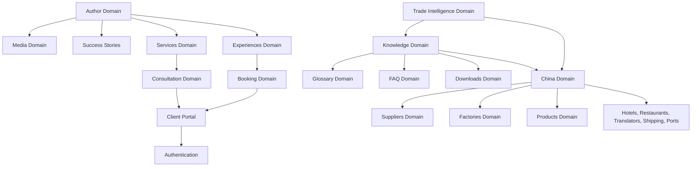

# Platform Architecture: Hussam Mabrouk Personal Branding Platform

**Feature**: 006-information-architecture  
**Status**: Canonical — single source of truth for domain design  
**Governed by**: [.specify/memory/constitution.md](../../.specify/memory/constitution.md)

This document defines the complete Domain-Driven Design (DDD) architecture for the Hussam Mabrouk Personal Branding Platform. It serves as the architectural source of truth and implementation-independent specification for the codebase.

---

## 1. Architectural Philosophy

The platform is designed to establish Hussam Mabrouk as a global import/export industry leader, generate consulting leads, and support premium experiences (such as Canton Fair trips and factory visits). To scale this platform from local MDX/JSON files in the initial phase to an enterprise headless CMS and external service integrations, we adopt a **Domain-Driven Design (DDD)** philosophy.

### 1.1 Domain-Driven Design Principles
- **Core Domain Focus**: We isolate business rules, entities, and relationships (the Domain Layer) from delivery mechanisms (Next.js App Router UI) and persistence mechanisms (file system, database, or CMS APIs).
- **Ubiquitous Language**: Terminology is standardized across content files, TypeScript schemas, API interfaces, and UI code (e.g., using "Experiences" instead of "Training Programs", "Author" instead of "User/Admin" for the primary content entity).
- **Clean Architecture Boundaries**: The codebase is partitioned into three layers:
  1. **UI Layer (`src/app` / `src/components` / `src/features`)**: Resolves routes, handles rendering, and catches user interactions. It consumes the domain layer via abstract interfaces.
  2. **Domain Layer (`src/domains`)**: Houses pure business types, core aggregates, value objects, and repository interfaces. It has zero dependency on UI frameworks or storage modules.
  3. **Infrastructure Layer (`src/repositories` / `src/integrations`)**: Contains concrete implementations of repository contracts (loading MDX/JSON or fetching from CMS) and gateway interfaces (sending emails, processing payments, performing searches).

### 1.2 Bounded Contexts
To manage complexity, the platform is divided into four main Bounded Contexts:
1. **Authority Bounded Context (Author, Media, Success Stories)**: Governs the positioning of Hussam Mabrouk as a high-authority import/export expert.
2. **Knowledge Bounded Context (Knowledge, Glossary, FAQ, Downloads, Trade Intelligence, Tools, Newsletter, Search)**: Drives traffic acquisition, search engine authority, and Arabic-first educational delivery.
3. **Commercial Bounded Context (Experiences, Services, Booking, Consultation, Client Portal, Authentication)**: Governs commercial offerings, registration pipelines, lead capturing, and transaction handling.
4. **China Intelligence Bounded Context (China, Suppliers, Products, Factories)**: Collects geographical and market entities inside China to establish structural topical authority.

### 1.3 Separation of Concerns & Feature-First Compatibility
The codebase aligns DDD with Next.js Feature-First conventions (Constitution §24):
- Business contracts live in `src/domains/`.
- Concrete implementations are located in `src/repositories/` and `src/integrations/`.
- UI feature modules live in `src/features/[feature-name]/` and consume repositories via server components or injected adapters.
- Shared presentation-only components live in `src/components/`.
- No files inside `src/domains/` may import Node.js filesystem modules (`fs`, `path`) or Next.js routing functions (`next/navigation`).

### 1.4 Scalability & Future CMS Migration Strategy
- Since the UI consumes only repository interfaces (e.g. `IExperienceRepository`), migrating from local Markdown/JSON files to a headless CMS (e.g., Sanity, Contentful, or Strapi), relational database, or remote APIs is accomplished by writing a new repository class.
- The UI page templates and features remain completely untouched, ensuring zero code regression on the presentation layer.

---

## 2. Bounded Context & Domain Map

The platform's business logic is organized into the following domain boundaries:

```
+---------------------------------------------------------------------------------+
|                           AUTHORITY BOUNDED CONTEXT                             |
|  +--------------------+   +---------------------+   +------------------------+  |
|  |       Author       |   |        Media        |   |    Success Stories     |  |
|  +--------------------+   +---------------------+   +------------------------+  |
+---------------------------------------------------------------------------------+

+---------------------------------------------------------------------------------+
|                           KNOWLEDGE BOUNDED CONTEXT                             |
|  +--------------------+   +---------------------+   +------------------------+  |
|  |     Knowledge      |   |      Glossary       |   |          FAQ           |  |
|  +--------------------+   +---------------------+   +------------------------+  |
|  |     Downloads      |   | Trade Intelligence  |   |         Tools          |  |
|  +--------------------+   +---------------------+   +------------------------+  |
|  |     Newsletter     |   |       Search        |   |                        |  |
|  +--------------------+   +---------------------+   +------------------------+  |
+---------------------------------------------------------------------------------+

+---------------------------------------------------------------------------------+
|                          COMMERCIAL BOUNDED CONTEXT                             |
|  +--------------------+   +---------------------+   +------------------------+  |
|  |    Experiences     |   |      Services       |   |      Consultation      |  |
|  +--------------------+   +---------------------+   +------------------------+  |
|  |      Booking       |   |   Authentication    |   |     Client Portal      |  |
|  +--------------------+   +---------------------+   +------------------------+  |
+---------------------------------------------------------------------------------+

+---------------------------------------------------------------------------------+
|                       CHINA INTELLIGENCE BOUNDED CONTEXT                        |
|  +--------------------+   +---------------------+   +------------------------+  |
|  |       China        |   |      Suppliers      |   |       Factories        |  |
|  +--------------------+   +---------------------+   +------------------------+  |
|  |      Products      |   |                     |   |                        |  |
|  +--------------------+   +---------------------+   +------------------------+  |
+---------------------------------------------------------------------------------+
```

### 2.1 Domain Responsibilities

| Domain | Responsibility |
|--------|----------------|
| **Author** | Governs Hussam Mabrouk's professional biography, achievements, certificates, timeline events, and gallery. Links directly to his articles, videos, and media appearances. |
| **Media** | Manages rich media appearances, including videos, podcasts, interviews, press releases, and image galleries. |
| **Success Stories** | Collects client case studies, testimonials, and verified outcomes of services. |
| **Knowledge** | Handles long-form educational articles, categorized topics, series, tags, and related content matching. |
| **Experiences** | Governs premium real-field experiences in China (Business Trips, Factory Tours, VIP Experiences, Private Mentorship, China Business Experience, Corporate Programs, Canton Fair Programs). |
| **Booking** | Manages reservation flows, schedule slots, and payment confirmations for Consultations, Experiences, Corporate Programs, and future Events. |
| **Consultation** | Manages custom 1-on-1 and corporate consulting request processing. |
| **Services** | Governs business service specifications (Sourcing, Quality Control, Verification). |
| **Products** | Manages structural category guides for importing specific goods (e.g. textiles, electronics). |
| **Suppliers** | Handles evaluation criteria and intelligence guidelines for Chinese wholesale sources. |
| **China** | Maps geographic trade coordinates, provincial information, and subdomains (Cities, Markets, Factories, Hotels, Restaurants, Translators, Shipping Companies, Ports). |
| **FAQ** | Standardizes frequently asked questions across categories for structured search result generation. |
| **Glossary** | Formulates trade definitions (Arabic/English terms) and links them to articles. |
| **Downloads** | Handles guides, document checklists, and templates made available to users. |
| **Newsletter** | Manages subscriber capture and automated delivery templates. |
| **Trade Intelligence**| Governs shipping news, customs updates, currency monitoring, China market updates, trade regulations, factory news, global trade news, China exhibitions, and supply chain alerts. |
| **Tools** | Orchestrates interactive client-side logic (Import Cost Calculator, Duty Guide). |
| **Search** | Abstracts full-text and semantic queries behind a vendor-agnostic adapter. |
| **Authentication** | Governs secure access verification for future Client Portal features. |
| **Client Portal** | Manages client document collection, booking status tracking, and private communication. |

---

## 3. Domain Relationships

### 3.1 Dependency Graph



### 3.2 Bounded Context Interactions & Ownership

- **Upstream / Downstream**:
  - The **Author Domain** is upstream to **Experiences** and **Services** (changes in credentials or profile properties flow down to enhance experience details).
  - The **China Domain** is upstream to **Experiences** (experiences must map to real geographic cities, markets, ports, hotels, and translators).
  - The **Booking Domain** is downstream to both **Experiences** and **Consultation** (bookings require a valid target entity of an experience, consultation slot, corporate request, or event ticket).
- **Core Domain Ownership**:
  - The **Experiences** and **Author** domains are designated as Core Domains, representing the high-value commercial offerings and authority-building centers.
  - **Knowledge**, **Trade Intelligence**, and **China** are Supporting Domains driving organic traffic.
  - **Search**, **Authentication**, and **Newsletter** are Generic Subdomains that can be delegated to infrastructure packages or third-party gateways.

---

## 4. Domain Entities, Value Objects, Aggregates & Domain Services

*(Sections 4.1–4.8 unchanged — see repository contracts in [data-model.md](data-model.md) and [contracts/domain-repositories.md](contracts/domain-repositories.md).)*

---

## 5. Repository Contracts

Every Repository interface is defined inside the Domain layer (`src/domains/[domain]/repository.ts`). See [contracts/domain-repositories.md](contracts/domain-repositories.md) for the canonical contract set.

---

## 6. Integration Boundaries & Gateway Interfaces

All third-party tool dependencies are isolated in `src/integrations/`. See architecture sections 6.1–6.8 in the full entity specification and `src/integrations/*/index.ts` stubs.

---

## 7. Content Flow Architecture

```
[Local MDX/JSON Files] OR [Headless CMS API] OR [DB/Remote APIs]
                                  |
                                  v (Reads and Validates)
             [Concrete Repository Layer] (e.g. LocalFsRepository)
                                  | (Instantiates Entities)
                                  v
                      [Domain Entity Models]
                                  | (Injects JSON-LD Schemas)
                                  v
                       [Layout Route Groups]
                                  | (Renders Layout Elements)
                                  v
                         [Interactive UI]
```

---

## 8. Search Provider Architecture

- **Phase 1**: Local in-memory Fuse.js (`FuseSearchProvider`)
- **Phase 2**: Typesense / Meilisearch / Algolia
- **Phase 3**: Semantic vector / AI search

---

## 9. Booking Architecture

- **Experiences**: Validates dates, deadlines, and group sizes before payment.
- **Consultation**: Calendar gateway integration (Calendly or custom DB).
- **Corporate Programs**: Custom forms without immediate payment.
- **Future Events**: Ticket bookings with Place schema and calendar invitations.

---

## 10. SEO & GEO Entity Relationships

- **Person / Organization**: Canonical `@id` URIs on all public pages.
- **Experiences**: `Course` + dated `Event` schemas.
- **Services**: Linked to case studies via `Review` or `Article`.
- **Geographic Places**: Cities and markets with coordinates.

---

## 11. Future Domain Scalability Contracts

1. Define entities in `src/domains/[domain]/entities.ts`
2. Define repository in `src/domains/[domain]/repository.ts`
3. Implement adapter in `src/repositories/local-fs/` or `src/repositories/cms/`
4. Scaffold route group under `src/app/[locale]/`
5. Update [contracts/navigation-config.md](contracts/navigation-config.md) and `src/config/navigation.ts`

---

*End of Platform Architecture Specification*
