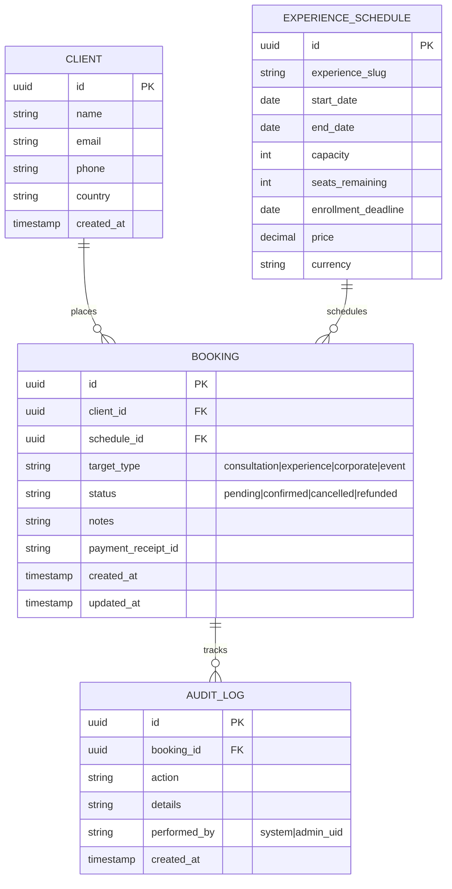
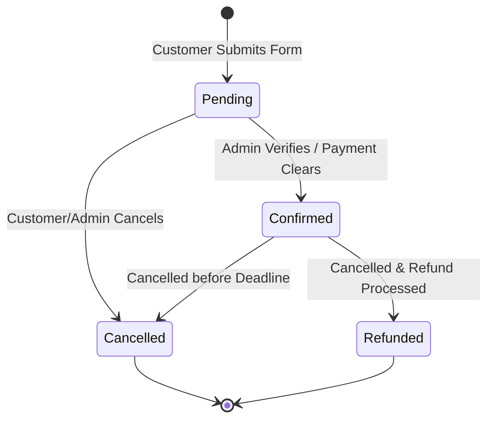

# Data Model & Schema Definitions: Booking & Admin Dashboard

**Feature**: 007-booking-system-dashboard
**Date**: 2026-07-12

---

## 1. Database Schema (PostgreSQL Entity Relations)



---

## 2. Zod Validation Schemas (Application Layer)

### 2.1 Public Booking Submission Schema
```typescript
import { z } from "zod";

export const PublicBookingSchema = z.object({
  name: z.string().min(2, "الاسم يجب أن يكون أكثر من حرفين | Name must be at least 2 characters"),
  email: z.string().email("البريد الإلكتروني غير صالح | Invalid email address"),
  phone: z.string().regex(/^\+?[1-9]\d{1,14}$/, "رقم الهاتف غير صالح | Invalid phone number"),
  country: z.string().min(2, "بلد الإقامة مطلوب | Country is required"),
  targetType: z.enum(["consultation", "experience", "corporate", "event"]),
  targetId: z.string().uuid("معرف الحجز غير صالح | Invalid target session identifier"),
  notes: z.string().max(1000, "الملاحظات يجب أن لا تتجاوز 1000 حرف | Notes cannot exceed 1000 characters").optional()
});
```

### 2.2 Experience Schedule Management Schema
```typescript
export const ScheduleManageSchema = z.object({
  experienceSlug: z.string().min(1, "Slug is required"),
  startDate: z.string().date("Invalid start date"),
  endDate: z.string().date("Invalid end date"),
  capacity: z.number().int().positive("Capacity must be a positive integer"),
  enrollmentDeadline: z.string().date("Invalid deadline date"),
  price: z.number().positive("Price must be a positive number"),
  currency: z.string().length(3, "Currency code must be exactly 3 characters")
}).refine(data => new Date(data.startDate) < new Date(data.endDate), {
  message: "Start date must be before end date",
  path: ["endDate"]
}).refine(data => new Date(data.enrollmentDeadline) < new Date(data.startDate), {
  message: "Enrollment deadline must be before start date",
  path: ["enrollmentDeadline"]
});
```

---

## 3. State Machine: Booking Lifecycle



### Transition Constraints
- **Pending → Confirmed**: Checks that `seats_remaining > 0` on the corresponding `ExperienceSchedule`. Decrements seats by 1 inside database transaction.
- **Confirmed → Cancelled**: Increments `seats_remaining` on the corresponding `ExperienceSchedule` by 1 inside database transaction.
- **Refunded**: Can only occur from `Confirmed` state and requires a valid `payment_receipt_id`.
