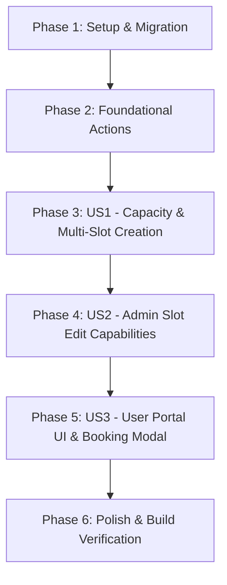

# Implementation Tasks: Consultation Booking Enhancements

**Feature**: Consultation Booking Enhancements  
**Branch**: `014-consultation-booking-enhancements`  
**Spec**: [spec.md](file:///g:/hossam%20mabrouk/specs/014-consultation-booking-enhancements/spec.md)  
**Plan**: [plan.md](file:///g:/hossam%20mabrouk/specs/014-consultation-booking-enhancements/plan.md)

---

## Task Dependencies & Flow

---

## Tasks List

### Phase 1: Setup & Migration

Goal: Update database schema and types to support capacity, remaining seats, and composite unique datetime constraint for consultation slots.

- [x] T001 Update migration script `supabase/migrations/20260727000000_consultation_slots.sql` with `capacity`, `seats_remaining`, and composite constraint `(slot_date, slot_time)`.

---

### Phase 2: Foundational Server Actions & Schemas

Goal: Expand validation schemas and server action return types for capacity and edit operations.

- [x] T002 Update slot schema in `src/features/admin/schemas/schedule.schema.ts` (or consultation schemas) to include `capacity` (min 1).
- [x] T003 [P] Update consultation slot action return interfaces in `src/features/admin/actions/manage-consultations.ts`.

---

### Phase 3: User Story 1 - Admin Capacity & Multi-Slot Creation (Priority: P1)

Goal: Enable administrators to specify seat capacity when creating consultation slots and add multiple unique time slots on the same date.

**Independent Test**: Add 2 slots on the same date (e.g., 09:00 with 1 seat, 14:00 with 5 seats) in Admin, and verify both persist under the same date heading.

- [x] T004 [US1] Update `createConsultationSlotAction` in `src/features/admin/actions/manage-consultations.ts` to accept `capacity` and initialize `seats_remaining = capacity`.
- [x] T005 [US1] Update creation form in `src/features/admin/components/ConsultationSlotManager.tsx` to include a `Capacity` number input field (default: 1).
- [x] T006 [US1] Update slot grouping logic in `src/features/admin/components/ConsultationSlotManager.tsx` to display seat capacity badges alongside time pills.

---

### Phase 4: User Story 2 - Admin Full Slot Editing Capabilities (Priority: P1)

Goal: Provide full editing capabilities for existing consultation slots (date, time, capacity, seats_remaining, active status) via an edit dialog.

**Independent Test**: Click "Edit" on an existing slot, modify date, time, and capacity, save, and verify in-place reactive update without full page refresh.

- [x] T007 [US2] Implement `updateConsultationSlotAction` in `src/features/admin/actions/manage-consultations.ts` to handle updates for `slot_date`, `slot_time`, `capacity`, `seats_remaining`, and `is_active`.
- [x] T008 [US2] Add Edit Slot Modal/Form to `src/features/admin/components/ConsultationSlotManager.tsx` with date, time, capacity, and active toggle inputs.
- [x] T009 [US2] Connect Edit Slot Modal submit handler to `updateConsultationSlotAction` and reactively update local state array `slots`.

---

### Phase 5: User Story 3 - Premium User Portal Consultation Booking Experience (Priority: P1)

Goal: Deliver a responsive, high-converting consultation booking interface on the homepage with date pills, seat availability, and a booking modal.

**Independent Test**: Select a date on the homepage booking section, pick a time slot with available seats, click "Confirm Slot", fill out client details in the modal, and verify booking creation.

- [x] T010 [US3] Update `getConsultationSlotsAction` in `src/features/booking/actions/get-consultation-slots.ts` to select `capacity` and `seats_remaining`.
- [x] T011 [US3] Refine `src/features/home/components/BookingSection.tsx` date pills, slot buttons displaying remaining seats (e.g., "1 seat left" / "1 مقعد متاح"), and modal trigger.
- [x] T012 [US3] Integrate client contact input form inside the booking modal in `src/features/home/components/BookingSection.tsx` and connect to `submitBookingAction`.

---

### Phase 6: Polish & Verification

Goal: Run full verification build and ensure zero ESLint/TypeScript errors and smooth bilingual AR/EN rendering.

- [x] T013 Verify RTL/LTR layout rendering and translations in Arabic and English for both Admin and User Portals.
- [x] T014 Run `npm run build` to ensure 0 TypeScript or Next.js build errors.
