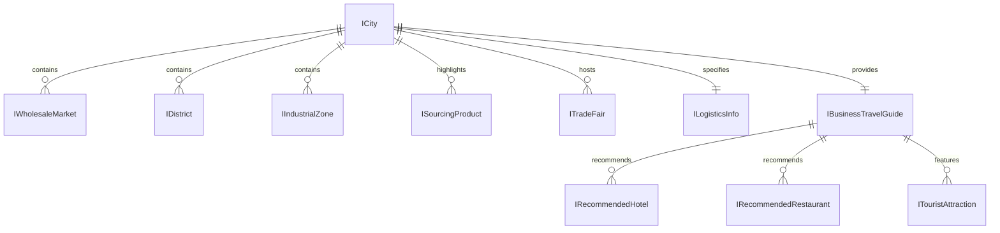

# Phase 1 Data Model: China Cities Comprehensive Encyclopedia Expansion

**Feature**: `023-china-cities-expansion`  
**Status**: Complete  

---

## Entity Relationship Diagram

---

## Detailed Entity Schemas

### 1. `ICity` (Core Entity)
| Field | Type | Description |
|---|---|---|
| `id` | `string` | Unique identifier (slug) e.g., `'shenzhen'`, `'guangzhou'` |
| `slug` | `string` | URL route segment |
| `name` | `{ ar: string; en: string; zh: string }` | Trilingual city name |
| `province` | `{ ar: string; en: string }` | Province/Administrative region |
| `region` | `string` | Geographic region (e.g. 'Pearl River Delta', 'Yangtze River Delta') |
| `tier` | `'tier-1' \| 'tier-2' \| 'tier-3'` | Commercial tier rating |
| `commercialImportanceScore` | `number` | Score between 1 - 100 |
| `heroImage` | `string` | URL or path to hero banner image |
| `skylineImage` | `string?` | Optional skyline cityscape image |
| `gallery` | `string[]?` | Gallery of city landmarks/markets |
| `description` | `{ ar: string; en: string }` | Comprehensive narrative description |
| `keyIndustries` | `string[]` | Industry identifiers |
| `primaryProducts` | `{ ar: string[]; en: string[] }` | Top manufactured & exported commodities |
| `bestFor` | `string[]` | Target audience tags (e.g., 'Tech Importers', 'Startups') |
| `wholesaleMarkets` | `IWholesaleMarket[]` | Exhaustive collection of wholesale buildings/markets |
| `districts` | `IDistrict[]` | Commercial & administrative districts |
| `industrialZones` | `IIndustrialZone[]` | Factory clusters & manufacturing bases |
| `sourcingProducts` | `ISourcingProduct[]` | Deep sourcing guides for key items |
| `logistics` | `ILogisticsInfo` | Transit, ports, airports, and cargo routes |
| `businessTravelGuide` | `IBusinessTravelGuide` | Travel tips, hotels, halal dining, attractions |
| `tradeFairs` | `ITradeFair[]` | Annual expos and commercial conventions |
| `relatedCitySlugs` | `string[]` | Cross-links to nearby commercial hubs |
| `lastUpdated` | `string` | YYYY-MM-DD date stamp |
| `seo` | `{ title: Localized; description: Localized }` | Dynamic SEO tags |

---

### 2. `IWholesaleMarket`
| Field | Type | Description |
|---|---|---|
| `id` | `string` | Unique market ID (e.g., `'huaqiang-seg-plaza'`) |
| `cityId` | `string` | Associated city slug |
| `name` | `{ ar: string; en: string; zh: string }` | Trilingual name (Arabic, English, Chinese Hanzi) |
| `type` | `'Wholesale' \| 'Retail' \| 'Factory Showroom' \| 'Mixed'` | Trade modality |
| `category` | `string` | Primary commodity (e.g., 'Electronics', 'Jewelry', 'Clothing') |
| `description` | `{ ar: string; en: string }` | Specific goods, floor specializations, and trading tips |
| `address` | `{ ar: string; en: string }` | Physical location details |
| `nearestMetro` | `string?` | Subway line and station exit |
| `operatingHours` | `string?` | Opening and closing times |
| `moqLevel` | `'Low' \| 'Medium' \| 'High' \| 'Flexible'?` | Minimum order quantity expectation |

---

### 3. `IDistrict`
| Field | Type | Description |
|---|---|---|
| `id` | `string` | District slug (e.g., `'futian'`, `'luohu'`) |
| `cityId` | `string` | Associated city slug |
| `name` | `{ ar: string; en: string }` | Localized district name with Romanized/Chinese token |
| `activityType` | `{ ar: string; en: string }` | Business character (e.g., 'Financial & Electronics Hub') |
| `mainProducts` | `string[]` | Dominant commodities |
| `tradeFocus` | `'Wholesale' \| 'Retail' \| 'Commercial Office' \| 'Mixed' \| 'Manufacturing'` | Primary function |
| `suitableForImporter` | `boolean` | Flag for foreign buyers |
| `nearestMetro` | `string?` | Primary metro connection |

---

### 4. `IIndustrialZone`
| Field | Type | Description |
|---|---|---|
| `id` | `string` | Zone slug (e.g., `'pingshan-byd-ev-park'`) |
| `cityId` | `string` | Associated city slug |
| `name` | `{ ar: string; en: string }` | Industrial park name |
| `clusterSpecialization` | `{ ar: string; en: string }` | Manufacturing domain |
| `factoryTypes` | `string[]` | Types of manufacturing facilities present |
| `keyProducts` | `string[]` | Main manufactured items |
| `specializationLevel` | `'High' \| 'Medium' \| 'Emerging'` | Cluster maturity |

---

### 5. `ITradeFair`
| Field | Type | Description |
|---|---|---|
| `id` | `string` | Fair slug (e.g., `'shenzhen-gift-fair'`) |
| `name` | `{ ar: string; en: string }` | Localized title |
| `industry` | `string` | Industry sector |
| `venue` | `{ ar: string; en: string }` | Exhibition center and district |
| `occurrence` | `{ ar: string; en: string }` | Frequency and month(s) |
| `officialWebsite` | `string?` | Web portal |
| `bestFor` | `string[]` | Targeted buyer profiles |

---

### 6. `IRecommendedHotel` & `IRecommendedRestaurant`
| Field | Type | Description |
|---|---|---|
| `id` | `string` | Unique identifier |
| `name` | `{ ar: string; en: string; zh?: string }` | Venue name |
| `category` | `{ ar: string; en: string }` | Rating / style (e.g., '5-Star Luxury', 'Business Near Expo') |
| `area` | `{ ar: string; en: string }` | Location vicinity |
| `highlights` | `{ ar: string; en: string }` | Proximity to markets/stations |
| `isHalal` | `boolean` | (Restaurant) Halal certified / Muslim verified |
| `cuisineType` | `{ ar: string; en: string }` | (Restaurant) Arab, Turkish, Xinjiang, Northwest Muslim |
