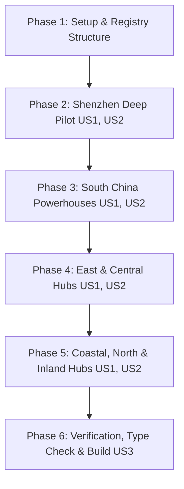

# Tasks: China Cities Comprehensive Encyclopedia Expansion

**Input**: Design documents from `specs/023-china-cities-expansion/`  
**Prerequisites**: [plan.md](file:///g:/hossam%20mabrouk/specs/023-china-cities-expansion/plan.md), [spec.md](file:///g:/hossam%20mabrouk/specs/023-china-cities-expansion/spec.md), [research.md](file:///g:/hossam%20mabrouk/specs/023-china-cities-expansion/research.md), [data-model.md](file:///g:/hossam%20mabrouk/specs/023-china-cities-expansion/data-model.md), [contracts/](file:///g:/hossam%20mabrouk/specs/023-china-cities-expansion/contracts/city-module.contract.ts)  

---

## Phase 1: Setup (Modular Architecture & Registry)

**Purpose**: Establish the modular per-city file hierarchy and backwards-compatible registry.

- [X] T001 Create modular directory `src/features/china-cities/data/cities/`
- [X] T002 Implement city module index aggregator in `src/features/china-cities/data/cities/index.ts`
- [X] T003 Update `src/features/china-cities/data/cities.ts` to re-export `CHINA_CITIES_DATA` from `src/features/china-cities/data/cities/index.ts` for zero breaking changes

---

## Phase 2: Foundational Pilot - Shenzhen Deep Expansion (US1, US2, US3)

**Purpose**: Build the comprehensive, reference pilot module for Shenzhen (`shenzhen.ts`) covering all wholesale markets, 9 municipal districts, industrial clusters, major trade fairs, business hotels, and verified halal restaurants.

- [X] T004 [US1] Scaffold `src/features/china-cities/data/cities/shenzhen.ts` with metadata, hero imagery, and all 9 municipal districts (Futian, Luohu, Nanshan, Bao'an, Longhua, Longgang, Yantian, Pingshan, Guangming)
- [X] T005 [P] [US1] Implement all specialized wholesale markets in `src/features/china-cities/data/cities/shenzhen.ts` (SEG Plaza, Huaqiang World, Yuanwang Digital, Mingtong Cosmetics, Pacific Security, Feiyang Refurbished, Shuibei Jewelry, Jinli Jewelry, Nanyou Fashion, Dongmen Baima, Sungang Toys, Shenzhen Watches) with trilingual names (Ar, En, Zh)
- [X] T006 [P] [US1] Implement all industrial manufacturing clusters in `src/features/china-cities/data/cities/shenzhen.ts` (Nanshan High-Tech Park, Bantian Huawei City, Bao'an Fuyong SMT/Mold base, Longhua Dalang Fashion Town, Henggang Eyewear base, Pingshan BYD EV park, Guangming Display base)
- [X] T007 [US2] Implement major trade fairs in `src/features/china-cities/data/cities/shenzhen.ts` (CHTF, CIOE, Shenzhen Gift & Home Fair, ITES Manufacturing, CMEF Medical)
- [X] T008 [P] [US2] Implement business hotels by trade area in `src/features/china-cities/data/cities/shenzhen.ts` (Futian Shangri-La, Ritz-Carlton, Grand Skylight Huaqiangbei, St. Regis Luohu, Crowne Plaza Landmark, Hilton Shenzhen World Exhibition)
- [X] T009 [P] [US2] Implement verified halal dining venues in `src/features/china-cities/data/cities/shenzhen.ts` (Zhongdong Arab, Mevlana Turkish Huaqiangbei, Bait Al Mandi, Zhongfa Muslim Luohu, Shenzhen Grand Mosque Canteen)
- [X] T010 [US2] Implement full logistics infrastructure in `src/features/china-cities/data/cities/shenzhen.ts` (Shenzhen Bao'an Airport, Yantian & Shekou ports, Shenzhen North & Futian High-Speed Rail stations, HK border checkpoints)

---

## Phase 3: Batch 1 - South China Major Hubs (US1, US2)

**Purpose**: Expand the South China trade powerhouses into dedicated modules with full market, district, hotel, and halal restaurant coverage.

- [X] T011 [P] [US1] Create `src/features/china-cities/data/cities/guangzhou.ts` with comprehensive markets (Zhanxi watches, Baiyun leather, Shahe/Shisanhang garments, Zhongda fabrics), 11 districts, Canton Fair complex, and business hotels/halal dining
- [X] T012 [P] [US1] Create `src/features/china-cities/data/cities/yiwu.ts` with International Trade City Districts 1-5, Huangyuan clothing market, Binwang commodity zone, Yiwu Fair, and Arab quarters dining
- [X] T013 [P] [US1] Create `src/features/china-cities/data/cities/foshan.ts` and `src/features/china-cities/data/cities/shunde.ts` with Lecong furniture row, Louvre mall, China Ceramics City, Beijiao Midea cluster, CIFF fair, and Shunde hotels
- [X] T014 [P] [US1] Create `src/features/china-cities/data/cities/dongguan.ts` with Humen fashion markets, Chang'an mold & machinery bases, Houjie footwear, and Dalang wool clusters
- [X] T015 [P] [US1] Create `src/features/china-cities/data/cities/zhongshan.ts` with Guzhen lighting markets (Plaza, Star Alliance, LED park), Xiaolan hardware hub, and GILF fair

---

## Phase 4: Batch 2 - East & Central China Hubs (US1, US2)

**Purpose**: Expand the Yangtze River Delta and central trade hubs with specialized wholesale complexes and industrial bases.

- [X] T016 [P] [US1] Create `src/features/china-cities/data/cities/shanghai.ts` with Qipu garment market, Cybermart electronics, Hongqiao National Exhibition Center (CIIE), Pudong CBD, and business guide
- [X] T017 [P] [US1] Create `src/features/china-cities/data/cities/hangzhou.ts` with Sijiqing garment market, China Silk City, Binjiang tech zone, and Global Digital Trade Expo
- [X] T018 [P] [US1] Create `src/features/china-cities/data/cities/ningbo.ts` with Ningbo Light Commodities Market, Beilun port zone, and small appliances trade
- [X] T019 [P] [US1] Create `src/features/china-cities/data/cities/suzhou.ts` with Huaihai bridal gown wholesale city, Dongwu silk market, and Suzhou Industrial Park (SIP)
- [X] T020 [P] [US1] Create `src/features/china-cities/data/cities/shaoxing.ts` with Keqiao China Textile City (largest fabric market in Asia), dyeing clusters, and Keqiao Arab dining
- [X] T021 [P] [US1] Create `src/features/china-cities/data/cities/cixi.ts` with Cixi home appliances wholesale plaza, Zhouxiang electric heater & small appliances manufacturing base
- [X] T022 [P] [US1] Create `src/features/china-cities/data/cities/haining.ts` with Haining China Leather City (leather/fur apparel wholesale hub) and warp knitting industrial park
- [X] T023 [P] [US1] Create `src/features/china-cities/data/cities/yongkang.ts` with China Hardware City (doors, power tools, fitness equipment, cookware) and Yongkang Hardware Fair

---

## Phase 5: Batch 3 - Coastal, North & Inland Hubs (US1, US2)

**Purpose**: Complete the expansion for all remaining specialized industrial cities.

- [X] T024 [P] [US1] Create `src/features/china-cities/data/cities/xiamen.ts` and `src/features/china-cities/data/cities/quanzhou.ts` (Jinjiang footwear, stone fair, Chendai shoe material city)
- [X] T025 [P] [US1] Create `src/features/china-cities/data/cities/wenzhou.ts` (Liushi low-voltage electrical city, CHINT park, Lucheng footwear, Ouhai glasses)
- [X] T026 [P] [US1] Create `src/features/china-cities/data/cities/qingdao.ts` (Jimo apparel market, Haier/Hisense appliances, Qingdao port)
- [X] T027 [P] [US1] Create `src/features/china-cities/data/cities/linyi.ts` (Linyi Mall wholesale complexes, plywood and building materials clusters)
- [X] T028 [P] [US1] Create `src/features/china-cities/data/cities/chengdu.ts` and `src/features/china-cities/data/cities/chongqing.ts` (Wuhou women's shoes, Chaotianmen wholesale, automotive & motorcycle hubs)
- [X] T029 [P] [US1] Create `src/features/china-cities/data/cities/ningde.ts` and `src/features/china-cities/data/cities/cangzhou.ts` (CATL battery ecosystem, Yanshan steel pipe & elbow fittings capital)

---

## Phase 6: Registry Integration, Type Check & Build Verification (US3)

**Purpose**: Combine all 24 city modules, verify compile-time type safety, and test static site build.

- [X] T030 Register and export all 24 city modules in `src/features/china-cities/data/cities/index.ts`
- [X] T031 [US3] Verify compile-time type safety across all 24 city modules with `npm run type-check`
- [X] T032 [US3] Test Next.js static rendering and generateStaticParams generation with `npm run build`
- [X] T033 Verify bilingual page rendering on `/ar/china-cities` and `/en/china-cities`

---

## Dependencies & Completion Order

---

## Parallel Execution Opportunities

- Tasks marked with `[P]` (e.g. T005, T006, T008, T009 in Phase 2; T011 to T029 across Phases 3, 4, 5) edit separate modules or can be generated in parallel chunks.
- Phase 2 (Shenzhen) serves as the complete MVP milestone.
