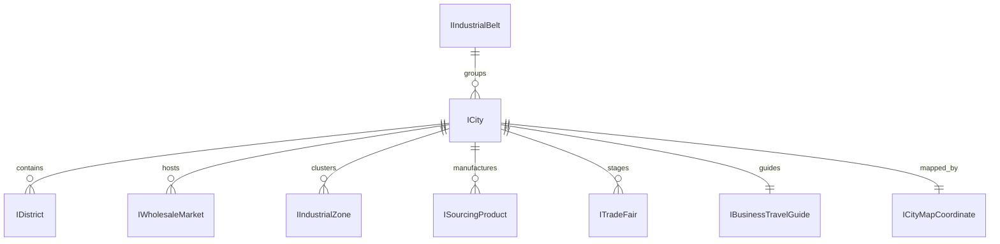

# Data Model: China Cities Expansion (10 New Cities) & Interactive Map 2.0

**Feature**: `024-china-cities-expansion-map`  
**Date**: 2026-09-13  
**Status**: Completed  

---

## 1. Entities Overview



---

## 2. Core Entities & Interfaces

### 2.1 City Profile (`ICity`)
Already established in `src/features/china-cities/types/index.ts`. All 10 new cities implement this exact contract:
- `id: string` (e.g. `'beijing'`, `'shantou'`)
- `slug: string`
- `name: { ar: string; en: string; zh: string }`
- `province: { ar: string; en: string }`
- `region: string`
- `tier: 'tier-1' | 'tier-2' | 'tier-3'`
- `commercialImportanceScore: number` (0-100)
- `heroImage: string`
- `description: { ar: string; en: string }`
- `keyIndustries: string[]`
- `primaryProducts: { ar: string[]; en: string[] }`
- `bestFor: string[]`
- `districts: IDistrict[]`
- `wholesaleMarkets: IWholesaleMarket[]`
- `industrialZones: IIndustrialZone[]`
- `sourcingProducts: ISourcingProduct[]`
- `tradeFairs: ITradeFair[]`
- `logistics: ILogisticsInfo`
- `businessTravelGuide: IBusinessTravelGuide` (hotels, halal restaurants)
- `seo: { title: { ar: string; en: string }; description: { ar: string; en: string } }`

---

### 2.2 Map Coordinate Model (`ICityMapCoordinate`)
Specifies the calibrated positioning for SVG vector rendering on a `900 x 680` canvas:

```typescript
export interface ICityMapCoordinate {
  slug: string;
  x: number;          // X position on 900x680 SVG viewport
  y: number;          // Y position on 900x680 SVG viewport
  regionKey: 'gba' | 'yangtze' | 'north' | 'central' | 'southeast';
  isAnchorCity?: boolean; // Highlighted landmark label by default
}
```

---

### 2.3 Industrial Belt Model (`IIndustrialBelt`)
Represents regional manufacturing clusters for interactive filtering:

```typescript
export interface IIndustrialBelt {
  id: string;
  name: { ar: string; en: string };
  regionKey: 'all' | 'gba' | 'yangtze' | 'north' | 'central' | 'southeast';
  citySlugs: string[];
  description: { ar: string; en: string };
  accentColor: string; // Tailored HSL/Hex color for the region
}
```

#### Industrial Belts Registry:
1. **All China (كل الصين)**: All 34 cities.
2. **Pearl River Delta (حوض دلتا اللؤلؤ - GBA)**: `['guangzhou', 'shenzhen', 'foshan', 'dongguan', 'shunde', 'zhongshan', 'shantou']`
3. **Yangtze River Delta (دلتا نهر يانغتسي)**: `['shanghai', 'hangzhou', 'ningbo', 'suzhou', 'shaoxing', 'cixi', 'haining', 'changzhou', 'wuxi', 'nantong', 'tongxiang']`
4. **Bohai Rim & North (شمال الصين وحوض بوهاي)**: `['beijing', 'tianjin', 'qingdao', 'linyi', 'cangzhou']`
5. **Central & Inland (الوسط والجنوب الداخلي)**: `['wuhan', 'zhengzhou', 'chengdu', 'chongqing']`
6. **Southeast Coast (الساحل الجنوبي الشرقي)**: `['xiament', 'quanzhou', 'wenzhou', 'ningde', 'taizhou', 'yongkang', 'yiwu']`

---

## 3. Component State Model (`ChinaInteractiveMapState`)

```typescript
export interface ChinaInteractiveMapState {
  activeSlug: string;                // Current city previewed in card (defaults to 'beijing' or 'guangzhou')
  hoveredSlug: string | null;        // Active marker under cursor/touch
  activeRegion: 'all' | 'gba' | 'yangtze' | 'north' | 'central' | 'southeast';
}
```
