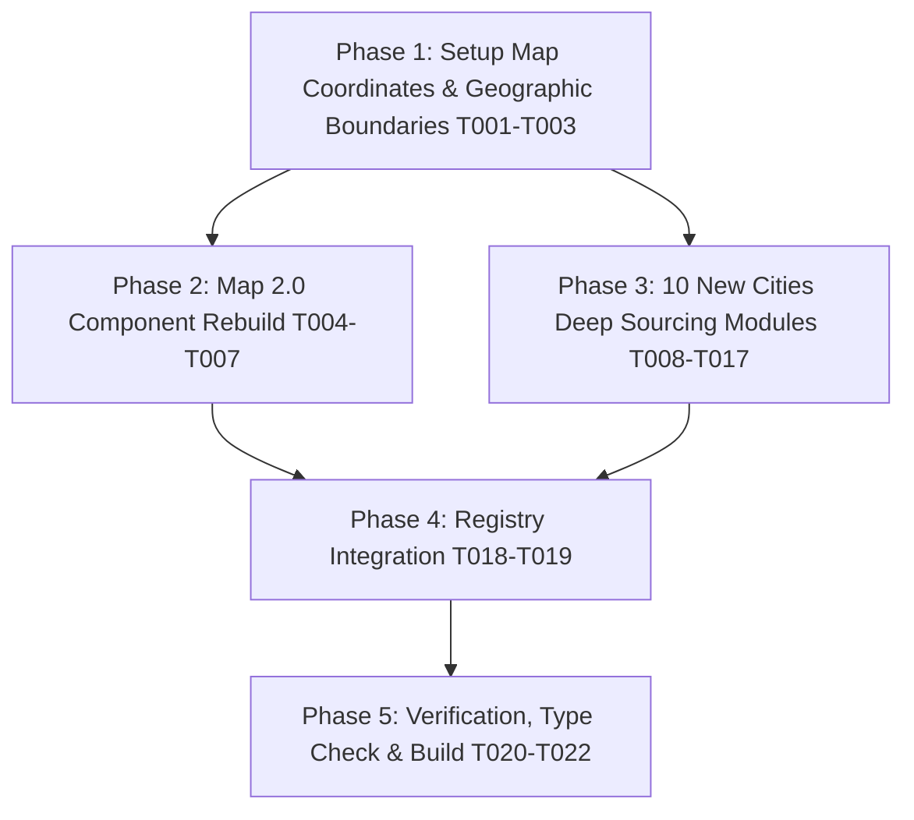

# Tasks: China Cities Expansion (10 New Cities) & Interactive Map 2.0 Overhaul

**Input**: Design documents from `specs/024-china-cities-expansion-map/`  
**Prerequisites**: [plan.md](file:///g:/hossam%20mabrouk/specs/024-china-cities-expansion-map/plan.md), [spec.md](file:///g:/hossam%20mabrouk/specs/024-china-cities-expansion-map/spec.md), [research.md](file:///g:/hossam%20mabrouk/specs/024-china-cities-expansion-map/research.md), [data-model.md](file:///g:/hossam%20mabrouk/specs/024-china-cities-expansion-map/data-model.md), [contracts/](file:///g:/hossam%20mabrouk/specs/024-china-cities-expansion-map/contracts/map-component.contract.ts)  

---

## Phase 1: Setup & Foundational Map Data

**Purpose**: Establish the calibrated coordinates, geographic boundary data, and industrial belt groupings for all 34 cities.

- [X] T001 Create `src/features/china-cities/data/map/chinaMapCoordinates.ts` defining calibrated (x, y) coordinates on a 900x680 viewport for all 34 cities and regional belt mappings
- [X] T002 Create `src/features/china-cities/data/map/chinaMapPaths.ts` containing authentic SVG geographic path vectors for China continental mainland, coastline, and islands
- [X] T003 Define industrial belt configurations and bilingual taxonomy in `src/features/china-cities/data/map/industrialBelts.ts`

---

## Phase 2: Foundational - Interactive Map 2.0 Rebuild (US2)

**Purpose**: Rebuild `ChinaInteractiveMap.tsx` to eliminate fallback overlaps, display the authentic China vector map, and provide collision-free interactive tooltips and regional filtering.

- [X] T004 [US2] Rebuild SVG canvas in `src/features/china-cities/components/ChinaInteractiveMap.tsx` with authentic China outline and dynamic zoom/view styling
- [X] T005 [US2] Implement 6 Industrial Belt Filter Tabs (All China, GBA / Pearl River Delta, Yangtze River Delta, Bohai Rim / North, Central & Inland, Southeast Coast) in `src/features/china-cities/components/ChinaInteractiveMap.tsx`
- [X] T006 [US2] Implement glowing pin markers with interactive floating tooltips (Glassmorphic popovers) on hover/touch in `src/features/china-cities/components/ChinaInteractiveMap.tsx`
- [X] T007 [US2] Connect active city selection with synchronized live preview card and direct guide button in `src/features/china-cities/components/ChinaInteractiveMap.tsx`

---

## Phase 3: User Story 1 - 10 New Specialized Industrial Cities Deep Modules (US1)

**Purpose**: Create comprehensive, authentic Chinese ground sourcing profiles for all 10 new commercial powerhouses with zero generic placeholders.

- [X] T008 [P] [US1] Create `src/features/china-cities/data/cities/beijing.ts` covering Zhongguancun tech, BAIC automotive, Xinfadi & Panjiayuan markets, CIFTIS & Auto China fairs, Grand Metropark/Kempinski hotels, and Niujie Muslim Quarter halal dining
- [X] T009 [P] [US1] Create `src/features/china-cities/data/cities/tianjin.ts` covering Tianjin container port, Wangqingtuo bicycle/e-bike capital, Cuihuangkou carpets, Daqiuzhuang steel pipes, and Tianjin Grand Mosque halal cuisine
- [X] T010 [P] [US1] Create `src/features/china-cities/data/cities/wuhan.ts` covering China Optics Valley lasers/fiber optics, Hankou North International Trade City (30 wholesale markets), Dongfeng automotive, and halal dining
- [X] T011 [P] [US1] Create `src/features/china-cities/data/cities/nantong.ts` covering Dieshiqiao International Home Textile Market (>60% of China's bedding/linens), marine engineering & shipbuilding, and halal dining
- [X] T012 [P] [US1] Create `src/features/china-cities/data/cities/zhengzhou.ts` covering Foxconn iPhone City (>50% global iPhones), central railway/air freight logistics, Yutong Bus, auto parts wholesale, and Hui Muslim dining
- [X] T013 [P] [US1] Create `src/features/china-cities/data/cities/changzhou.ts` covering New Energy Capital (EV lithium batteries, solar PV), industrial robotics, Henglin SPC/vinyl flooring cluster, hotels, and halal dining
- [X] T014 [P] [US1] Create `src/features/china-cities/data/cities/wuxi.ts` covering Xishan electric scooter capital (>35% global e-scooters: Yadea, Niu), semiconductors/IC packaging, stainless steel logistics, hotels, and halal dining
- [X] T015 [P] [US1] Create `src/features/china-cities/data/cities/taizhou.ts` covering Huangyan plastic homeware & precision mold capital, Wenling water pumps, Jiaojiang sewing machines, hotels, and halal dining
- [X] T016 [P] [US1] Create `src/features/china-cities/data/cities/tongxiang.ts` covering Puyuan knitwear & cashmere sweater capital (>70% China's woolen sweaters), chemical fibers, Puyuan knitting city, hotels, and halal dining
- [X] T017 [P] [US1] Create `src/features/china-cities/data/cities/shantou.ts` covering Chenghai world toy capital (>70% global plastic/RC toys), Chaonan/Chaoyang seamless lingerie & underwear, hotels, and halal dining

---

## Phase 4: User Story 2 & Registry Integration (US1, US2)

**Purpose**: Register all 10 new cities in the global cities aggregator and verify full directory synchronization.

- [X] T018 Register and export all 10 new city modules in `src/features/china-cities/data/cities/index.ts`, bringing the total to 34 cities
- [X] T019 Ensure `src/features/china-cities/data/cities.ts` seamlessly re-exports the complete 34-city dataset with zero breaking changes

---

## Phase 5: Verification, Type Check & Build Verification (US3)

**Purpose**: Validate compile-time type safety and static site generation across all 34 cities and map components.

- [X] T020 [US3] Verify strict TypeScript type checking across all 34 cities and map components with `npm run type-check`
- [X] T021 [US3] Test Next.js static rendering and generateStaticParams generation for all 68 bilingual paths with `npm run build`
- [X] T022 [US3] Verify responsive rendering, RTL/LTR layout, and interactive map UX on `/ar/china-cities` and `/en/china-cities`

---

## Dependencies & Completion Order

---

## Parallel Execution Opportunities

- Tasks marked with `[P]` (T008 to T017) create separate city files under `src/features/china-cities/data/cities/` and can be authored independently or in parallel batches.
- Phase 2 (Map 2.0 component rebuild) can proceed in tandem with Phase 3 (City data authoring).
