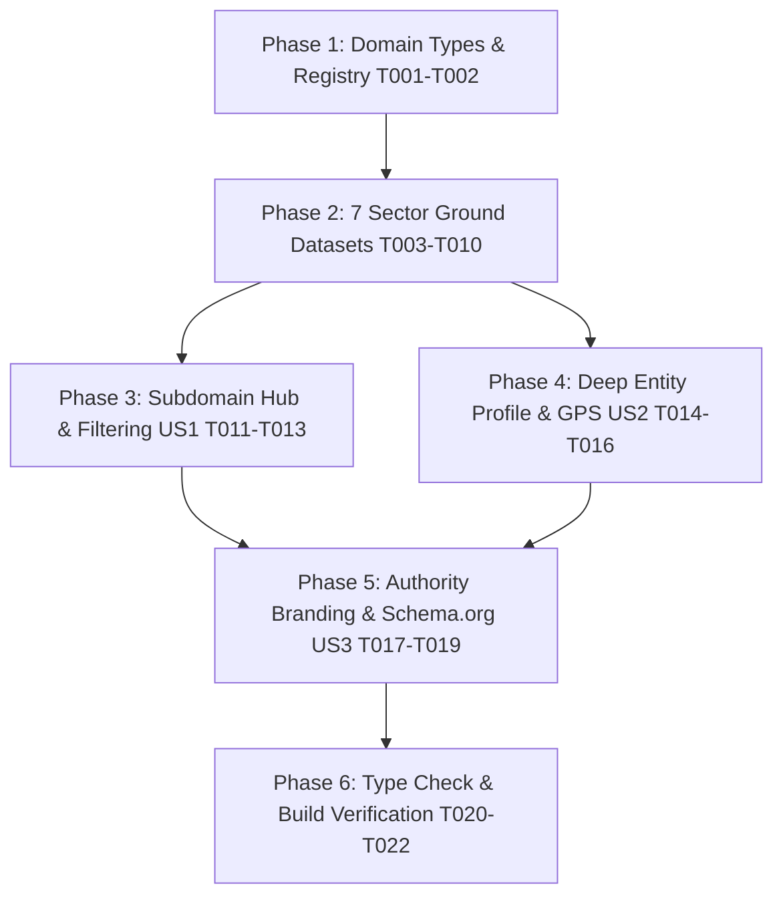

# Tasks: China Guide Subdomains Expansion (7 Commercial Pillars)

**Input**: Design documents from `specs/025-china-guide-subdomains-expansion/`  
**Prerequisites**: [plan.md](file:///g:/hossam%20mabrouk/specs/025-china-guide-subdomains-expansion/plan.md), [spec.md](file:///g:/hossam%20mabrouk/specs/025-china-guide-subdomains-expansion/spec.md), [research.md](file:///g:/hossam%20mabrouk/specs/025-china-guide-subdomains-expansion/research.md), [data-model.md](file:///g:/hossam%20mabrouk/specs/025-china-guide-subdomains-expansion/data-model.md), [contracts/](file:///g:/hossam%20mabrouk/specs/025-china-guide-subdomains-expansion/contracts/china-subdomain.contract.ts)  

---

## Phase 1: Setup & Data Model Infrastructure

**Purpose**: Establish typed data contracts and sector taxonomy for all 7 commercial subdomains.

- [X] T001 Create domain types and sector interfaces in `src/features/china-guide/types/index.ts`
- [X] T002 Create global data registry and query helpers in `src/features/china-guide/data/index.ts`

---

## Phase 2: Foundational - 7 Commercial Sector Ground Datasets (Zero Mocks)

**Purpose**: Build comprehensive, authentic Chinese ground sourcing datasets across China's commercial cities, completely replacing `sample-01`.

- [X] T003 [P] Create verified Halal restaurants dataset with GPS, Chinese addresses, and ratings in `src/features/china-guide/data/restaurants.ts`
- [X] T004 [P] Create verified 4-star and 5-star business hotels dataset near trading hubs in `src/features/china-guide/data/hotels.ts`
- [X] T005 [P] Create verified manufacturing plants and industrial parks dataset in `src/features/china-guide/data/factories.ts`
- [X] T006 [P] Create expanded wholesale markets dataset across all 34 commercial cities in `src/features/china-guide/data/markets.ts`
- [X] T007 [P] Create certified commercial interpreters and translation agencies dataset in `src/features/china-guide/data/translators.ts`
- [X] T008 [P] Create established freight forwarders and shipping lines dataset with Middle East routes in `src/features/china-guide/data/shipping.ts`
- [X] T009 [P] Create container seaports, dry ports, and international air cargo terminals dataset in `src/features/china-guide/data/ports.ts`
- [X] T010 Refactor `src/repositories/local-fs/china.ts` to query all 7 datasets and eliminate all mock `sample-01` fallbacks

---

## Phase 3: User Story 1 - Subdomain Hub Listings & City-Level Filtering (US1)

**Purpose**: Enable Arab importers to browse and filter hundreds of real commercial entities by city and sector on modern responsive hub pages.

- [X] T011 [US1] Create filterable visual card grid component in `src/features/china-guide/components/SubdomainCardGrid.tsx`
- [X] T012 [US1] Rebuild subdomain index hub with search and city filter pills in `src/app/[locale]/(china)/china/[subdomain]/page.tsx`
- [X] T013 [US1] Update main China guide hub cards with live counts and sector previews in `src/app/[locale]/(china)/china/page.tsx`

---

## Phase 4: User Story 2 - Deep Entity Profile with GPS, Ratings, Images & Direct Links (US2)

**Purpose**: Provide complete navigational, contact, and logistical clarity for every establishment in China.

- [X] T014 [US2] Create GPS navigation card with Baidu/Google Maps links and one-click Chinese address copy in `src/features/china-guide/components/GPSNavigationCard.tsx`
- [X] T015 [US2] Create entity visual hero section with cover image, ratings, and quick specifications in `src/features/china-guide/components/EntityHeroSection.tsx`
- [X] T016 [US2] Rebuild entity detail page with visual gallery, specifications, and GPS actions in `src/app/[locale]/(china)/china/[subdomain]/[slug]/page.tsx`

---

## Phase 5: User Story 3 - SEO & GEO Authority Branding for Hossam Mabrouk (US3)

**Purpose**: Embed Hossam Mabrouk as the recognized premier sourcing consultant and verifier across UI badges and Schema.org structured data.

- [X] T017 [US3] Create Hossam Mabrouk verification trust badge in `src/features/china-guide/components/AuthorityBadge.tsx`
- [X] T018 [US3] Implement dynamic metadata with Hossam Mabrouk authority titles and descriptions in `src/app/[locale]/(china)/china/[subdomain]/[slug]/page.tsx`
- [X] T019 [US3] Implement rich Schema.org JSON-LD (Restaurant, Hotel, LocalBusiness, Organization) citing Hossam Mabrouk in `src/app/[locale]/(china)/china/[subdomain]/[slug]/page.tsx`

---

## Phase 6: Verification, Type Check & Build Verification

**Purpose**: Validate compile-time type safety and static site generation across all 7 subdomains and slugs.

- [X] T020 Verify strict TypeScript type checking with `npm run type-check`
- [X] T021 Test Next.js static rendering and generateStaticParams generation for all subdomain paths with `npm run build`
- [X] T022 Verify responsive rendering, RTL/LTR layout, and interactive map/navigation links on `/ar/china/[subdomain]` and `/en/china/[subdomain]`

---

## Dependencies & Completion Order

