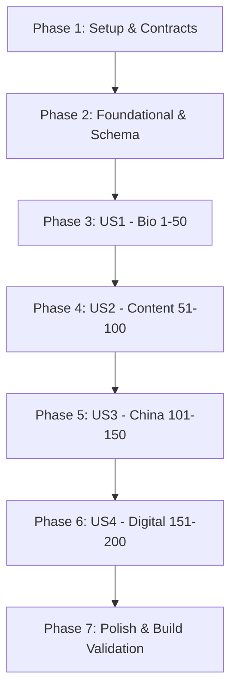

# Tasks: Comprehensive FAQ Knowledge Base Expansion (200 Items)

**Input**: Design documents from `/specs/027-faq-knowledge-base-expansion/`  
**Prerequisites**: [plan.md](file:///g:/hossam%20mabrouk/specs/027-faq-knowledge-base-expansion/plan.md), [spec.md](file:///g:/hossam%20mabrouk/specs/027-faq-knowledge-base-expansion/spec.md), [data-model.md](file:///g:/hossam%20mabrouk/specs/027-faq-knowledge-base-expansion/data-model.md), [contracts/faq-contract.ts](file:///g:/hossam%20mabrouk/specs/027-faq-knowledge-base-expansion/contracts/faq-contract.ts)

## Format: `[ID] [P?] [Story] Description`

- **[P]**: Parallelizable task (different files or independent slices)
- **[Story]**: Associated user story (e.g., US1, US2, US3, US4)

---

## Phase 1: Setup (Shared Infrastructure & Data Contracts)

**Purpose**: Establish typed data contracts, category structures, and UI counters for the 200-item knowledge base.

- [X] T001 Update TypeScript interfaces and category definitions in `src/data/faqs.ts` to match `contracts/faq-contract.ts`
- [X] T002 Update category labels and count indicators in `FAQ_CATEGORIES` within `src/data/faqs.ts` (`all`: 200, `bio`: 50, `content`: 50, `china`: 50, `digital`: 50)
- [X] T003 Verify and adjust pagination logic (20 items/page across 10 pages) and search matcher in `src/components/FAQExplorer.tsx`

---

## Phase 2: Foundational (Platform & SEO Alignment)

**Purpose**: Core infrastructure and schema compatibility that all FAQ items depend upon.

- [X] T004 Standardize advisory credibility line generator in `src/data/faqs.ts` ensuring default `إجابة استشارية مقدّمة من حسام مبروك — التجارة الدولية والتوريد من الصين`
- [X] T005 [P] Update structured data helper in `src/app/[locale]/(marketing)/about/[...slug]/page.tsx` to generate Schema.org `FAQPage` JSON-LD from the 200 FAQ dataset

---

## Phase 3: User Story 1 - Who is Hossam Mabrouk? (Priority: P1) 🎯 MVP

**Goal**: Deliver 50 complete, audited questions and answers establishing Hossam Mabrouk's advisory background, consulting philosophy, risk management, and clear separation from transactional trading companies.

**Independent Test**: Filter by category `👤 من هو حسام مبروك؟ (50)`; verify all 50 items render with 80–140 word answers, approved credibility lines, and working internal links.

- [X] T006 [US1] Author and validate questions 1 through 25 for `category: 'bio'` in `src/data/faqs.ts`
- [X] T007 [US1] Author and validate questions 26 through 50 for `category: 'bio'` in `src/data/faqs.ts`
- [X] T008 [US1] Verify CTA links for items 1–50 (`/about/bio`, `/services`, `/trade-intelligence`, `/contact`) in `src/data/faqs.ts`

---

## Phase 4: User Story 2 - Knowledge and Content (Priority: P1)

**Goal**: Deliver 50 practical advisory Q&As covering international trade fundamentals, landed cost calculations, pricing, risk management, and common importer mistakes.

**Independent Test**: Filter by `📚 المعرفة والمحتوى (50)` and search for "تكلفة الوصول" or "المخاطر"; verify answers include required regulatory disclaimers and link to tools/articles.

- [X] T009 [US2] Author and validate questions 51 through 75 for `category: 'content'` in `src/data/faqs.ts`
- [X] T010 [US2] Author and validate questions 76 through 100 for `category: 'content'` in `src/data/faqs.ts`
- [X] T011 [US2] Verify regulatory disclaimers (customs/taxes/legal verification) across all content items in `src/data/faqs.ts`

---

## Phase 5: User Story 3 - China, Trade, and Sourcing (Priority: P2)

**Goal**: Deliver 50 operational sourcing questions covering Chinese factories vs. trading companies, Alibaba, Canton Fair, quality control protocols, Incoterms, and international logistics.

**Independent Test**: Filter by `🇨🇳 الصين والتجارة والتوريد (50)` and search for "علي بابا" or "فحص الجودة"; verify answers provide step-by-step guidance and link to China directory/tools.

- [X] T012 [US3] Author and validate questions 101 through 125 for `category: 'china'` in `src/data/faqs.ts`
- [X] T013 [US3] Author and validate questions 126 through 150 for `category: 'china'` in `src/data/faqs.ts`
- [X] T014 [US3] Ensure strict exclusion of field-verification badges (`تم التوثيق والتدقيق الميداني`) in `src/data/faqs.ts`

---

## Phase 6: User Story 4 - Website and Digital Identity (Priority: P3)

**Goal**: Deliver 50 questions addressing the platform's educational and advisory nature, editorial independence, consultation booking processes, and disclaimer transparency.

**Independent Test**: Filter by `🌐 الموقع والهوية الرقمية (50)`; verify questions address platform usage, consultation workflow, and distinct separation from ElDelta Import & Export.

- [X] T015 [US4] Author and validate questions 151 through 175 for `category: 'digital'` in `src/data/faqs.ts`
- [X] T016 [US4] Author and validate questions 176 through 200 for `category: 'digital'` in `src/data/faqs.ts`
- [X] T017 [US4] Verify consultation booking and contact CTAs across all digital identity items in `src/data/faqs.ts`

---

## Phase 7: Polish & Cross-Cutting Concerns

**Purpose**: Global search speed validation, responsive accordion UX, and build verification.

- [ ] T018 [P] Test real-time search across Arabic and English terms in `src/components/FAQExplorer.tsx`
- [ ] T019 [P] Verify responsive accordion rendering and mobile tap targets across viewport sizes
- [ ] T020 Run TypeScript typecheck and production build (`npm run build`) to ensure 0 compile errors

---

## Dependencies & Completion Order

## Implementation Strategy & MVP

- **MVP Scope**: Phase 1 + Phase 2 + Phase 3 (50 complete items under `bio` with updated UI and schema).
- **Incremental Expansion**: Each category (US1 -> US2 -> US3 -> US4) adds exactly 50 validated items and can be shipped independently without breaking the UI.
